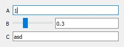

# propsettings_qt

This package provides a mechanism of automatic PySide2 (Qt) widget generation to edit member variables of an object.
The variables should be registered as a propsettings.Setting. See [propsettings](https://github.com/mnicolas94/propsettings) for more information.

# Installation

`pip install propsettings-qt`

# Usage

The most common usage of this package is through the `SettingsAreaWidget` Qt widget class. e.g. For a given class decorated with `propsettings`'s Settings
```python
from propsettings.configurable import register_as_setting
from propsettings.setting_types.range_setting_type import Range

class Example:

    def __init__(self):
        self.a = 1
        self.b = 0.3
        self.c = 'asd'

register_as_setting(Example, "a")
register_as_setting(Example, "b", setting_type=Range(0.0, 1.0))
register_as_setting(Example, "c")
```

it can be drawn in a UI with
```python
from propsettings_qt.ui_settings_area import SettingsAreaWidget

widget = SettingsAreaWidget()
example_object = Example()
widget.populate_object(example_object)
```

The resulting `widget` will look like


